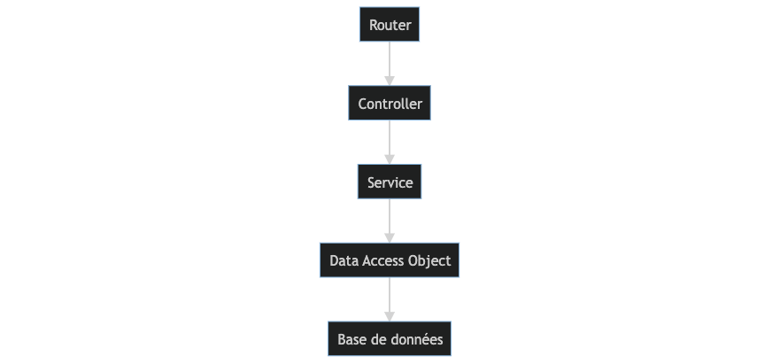
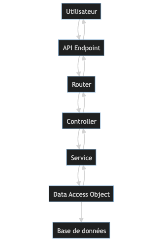
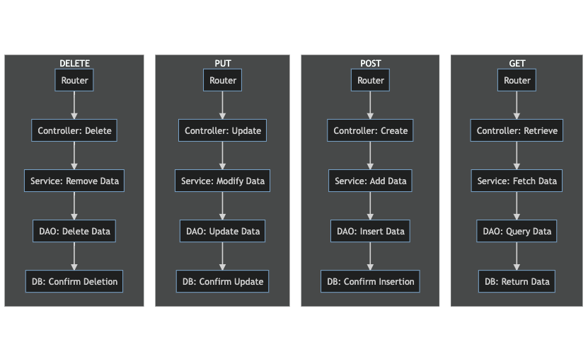

<style>
  :body {
    --color-highlight: #EE0000;
    --color-highlight-hover: #aaf;
    --color-highlight-heading: #EE0000;
    --color-header: #bbb;
    --color-header-shadow: transparent;
  }
  h1 {
    font-size: 1.5em;
    color: #;
  }
  h2 {
    font-size: 1.2em;
    color: #;
    text-align: left
  }
  h3 {
    font-size: 1.0em;
    color: #;
    text-align: left
  }
  p {
  text-align: center;
  }
</style>

# **COURS WEB ET MOBILE AVANCEE**

## Ousman GNALY

### Universite Islamique au Niger

---

# ***Concepts Fondamentaux***

---

## Diagrams



---

## Diagrams 2



---

## Diagrams 3


---

## Diagrams 4



---

```mermaid 
graph TB
    U[Utilisateur] --> A[Authentification]
    A --> V[Vérification]
    V --> S[Session]
    S --> R[Requête sécurisée]


``````