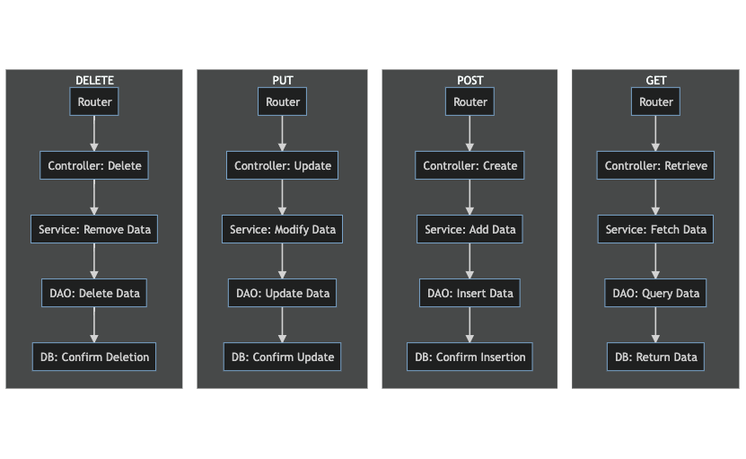

<style>
  :body {
    --color-highlight: #EE0000;
    --color-highlight-hover: #aaf;
    --color-highlight-heading: #EE0000;
    --color-header: #bbb;
    --color-header-shadow: transparent;
  }
  h1 {
    font-size: 1.5em;
    color: 
  }
  h2 {
    font-size: 1.2em;
    color: #;
    text-align: left
  }
  h3 {
    font-size: 1.0em;
    color: #;
    text-align: left
  }
  p {
  text-align: left;
  }
</style>

# **COURS WEB ET MOBILE AVANCEE**

## Ousman GNALY

### Universite Islamique au Niger

---

# ***Architecture Backend***

---

- Présentation de l'architecture : Routers, Controllers, Services, DAO
- Importance de chaque composant et son rôle

---
#  ***Explication des Éléments***

---

## 1. Router (Routeur)

Le **Router** est responsable de la définition des routes ou des endpoints auxquels les clients peuvent envoyer des requêtes. Il sert d'intermédiaire entre le client et les contrôleurs, dirigeant chaque requête vers le contrôleur approprié en fonction de l'URL et de la méthode HTTP utilisée.

---

```typescript
import express from 'express';
const router = express.Router();

// Définition d'une route GET pour récupérer un utilisateur par ID
router.get('/users/:id', userController.getUser);

export default router;

```

---

## 2. Controller (Contrôleur)

Le **Controller** agit comme un gestionnaire pour chaque route. Il reçoit les requêtes du routeur, traite les données entrantes, fait appel aux services appropriés pour traiter la logique métier, puis renvoie une réponse au client. Le contrôleur sert d'interface entre le routeur et les services.

---

```typescript
const userController = {
    getUser: async (req, res) => {
        try {
            const userId = req.params.id;
            const user = await userService.getUserById(userId);
            res.json(user);
        } catch (error) {
            res.status(500).send(error.message);
        }
    }
};

```


---

## 3. Service

Le **Service** est responsable de la logique métier de l'application. Il traite les données, effectue des opérations spécifiques et interagit avec la couche DAO pour accéder ou modifier les données dans la base de données. Les services assurent que la logique métier est bien organisée et séparée de la logique d'accès aux données.

---

```typescript
const userService = {
    getUserById: async (id) => {
        return await userDao.getById(id);
    }
};


```

---

## 4. DAO (Data Access Object)

Le **DAO (Data Access Object)** est une interface entre le service et la base de données. Il contient des méthodes spécifiques pour interroger, insérer, mettre à jour ou supprimer des données dans la base de données. Le DAO s'assure que toutes les interactions avec la base de données sont effectuées de manière optimale et sécurisée.

---

## Exemple de la couche DAO avec Prisma


---
## PrismaJS : Une Vue d'Ensemble

### Qu'est-ce que PrismaJS ?

**PrismaJS** est un ORM (Object-Relational Mapping) moderne pour Node.js et TypeScript. Il vise à faciliter les interactions entre votre code et votre base de données, offrant une couche d'abstraction puissante et flexible.

---

### Importance de PrismaJS

Avec la croissance et la complexité croissantes des applications modernes, la gestion efficace des bases de données est cruciale. PrismaJS offre une solution robuste pour :

---

- Interagir avec plusieurs bases de données.
- Générer automatiquement des requêtes SQL optimisées.
- Assurer la sécurité et éviter les vulnérabilités courantes comme les injections SQL.

---

### Avantages de PrismaJS

---

1. **Type-Safe** : Grâce à l'intégration étroite avec TypeScript, PrismaJS génère des types à partir de votre schéma de base de données, garantissant ainsi la sécurité des types lors de l'interaction avec la base de données.

---

2. **Auto-génération du client** : Prisma Client est généré automatiquement à partir de votre schéma, ce qui signifie moins de code à écrire et à maintenir.

---

3. **Migrations simplifiées** : Avec Prisma Migrate, vous pouvez facilement gérer et appliquer des modifications à votre base de données.

---

4. **Support pour plusieurs bases de données** : PrismaJS prend en charge de nombreuses bases de données relationnelles, y compris PostgreSQL, MySQL, SQLite, et SQL Server.

---

5. **Performances optimisées** : PrismaJS génère des requêtes SQL optimisées pour garantir des performances maximales.

---
En conclusion, PrismaJS est un outil puissant pour les développeurs modernes, offrant une combinaison unique de flexibilité, de sécurité et de performance lors de l'interaction avec des bases de données relationnelles.


---

### DAO (Data Access Object) avec Prisma

Avec Prisma, la couche DAO devient plus simple et plus intuitive. Prisma fournit un ORM (Object-Relational Mapping) qui facilite les interactions avec la base de données.

Voici comment vous pourriez structurer votre DAO avec Prisma :

---

```typescript
import { PrismaClient } from '@prisma/client';

const prisma = new PrismaClient();

const userDao = {
    getById: async (id) => {
        return await prisma.user.findUnique({ where: { id: parseInt(id) } });
    },
    // Autres méthodes pour insérer, mettre à jour, supprimer, etc.
};
```

---

En combinant ces éléments, vous obtenez une architecture solide et modulaire qui sépare clairement les responsabilités, rendant votre application backend maintenable, évolutif et facile à déboguer.

---

## Diagrams

